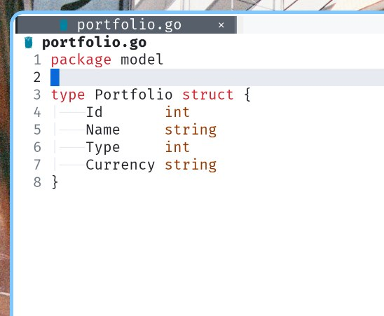
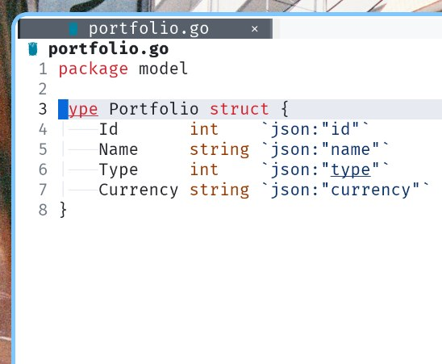

# go-add-tag

Утилита для автоматического добавления JSON-тегов к структурам Go

 → 

## Установка

```bash
go install github.com/probeldev/go-add-tag@latest
```


## Использование

Через Vim

    Выделите структуру в визуальном режиме

    Выполните команду:

    :'<,'>!addjsontags
